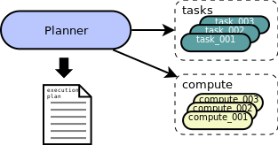

# Approach #

I approached this problem as a graphing and bin packing problem.  This is a
fairly standard way to approach job scheduling and there's good support for
these approaches in standard libraries.  Beyond the sequencing of jobs, I chose
to go with simple hueristics to inform task/compute selection process (i.e.,
bin packing).  This is an area I would have worked on more (code changes,
tuning, possible different approaches) if I had more time.  I was able to do
minimal tuning though; the rudimentary analysis code I added proved useful
given the deadline.

## Language ##
I chose to use C++ as the language for this project.  C++ and Boost support
containers that could be used to simplify object management, limit copying, and
avoid memory leaks.  The other language choices I could have made for this
project are Java, Perl or Python.  While these might have been easier to
implement, I suspect these languages' overhead would prevent an equally-well
implemented project in any of those languages from scaling as far as the C++
version would.

I implemented the dataset generator script `test/make_tasks_comp.py` in Python
and used only core libraries.  I considered using a yaml emitter library for
this, but it didn't seem important enough to create a less likely dependency.
The script writes both the compute and task files.  I'm not very familiar with
yaml, but the output is compliant-enough for the libcpp-yaml parser code.

## Single-threaded ##
I chose to implement a single-threaded planner mainly due to time constraints.
This is probably performance-limiting on larger data sets, at least for some
steps.  Sections of the planner are CPU-bound or I/O-bound.  Some of these
sections could be broken down into smaller, independent sets of tasks.

## Memory ##
I opted to allocate long-lived structures for tasks and compute resources and
to only reference these objects either using `boost::shared_ptr<>` or plain
pointers.  This was a choice made mainly out of practicality and appreciation
of the deadline.  A more sophisitcated memory object management regime might
work better overall or enable other use cases for this code.  That said,
valgrind memcheck runs cleanly and I have avoided static initialization for
complex types.

## Libraries ##
There are significant uses of two less common libraries.  The first is the C++
yaml parser.  I used `libyaml-cpp`[^1] for this.  This library allowed me to
easily model the file format and reduce the amount of coding and debugging
required to parse the files.  

I've used `boost::graph` (BGL)[^2] for the graphing library.  It's fairly
well generalized for this purpose and others.  My implementation is pretty
standard except that I didn't implement visitors and instead drive the job
scheduling oustide of the library.  The use of visitors might make sense for
some parts of the graphing code, but I didn't think it was important enough to
adapt what I had to use it.

I made significant use of the STL.
## Assumptions ##
I clarified the most important assumptions I made early on:

* The planner algorithm runs offline.
* Jobs require enough runtime that a reasonably fast scheduling algorithm isn't huge overhead.

Some other assumptions I've been working with:

* There are always many more tasks than compute nodes.
* The tasks nodes' and compute nodes' properties don't follow any particular pattern.

# Model #
The approach I took included modeling the objects in this system.  I used
three main classes to do this.  Consider this simplified diagram.



The high level planner operations are:

1. Validate core availability for each task.
2. Map task dependencies.
3. Build dependency graph.
4. Schedule tasks as dependencies are met.

# Build #
The code builds in the `src` directory.  There are only a few packages that you
would need above and beyond a base install of Ubuntu, even fewer above and
beyond a base install of Ubuntu with fairly standard development packages
installed.
## Dependencies / Versions##
* libyaml-cpp      (used libyaml-cpp-dev on Ubuntu 16.04)
* Boost            (used libboost-dev on Ubuntu 16.04)
  * program_options
  * graph
  * shared_ptr
* gcc version 5.3.1 20160413 (Ubuntu 5.3.1-14ubuntu2.1)
* GNU make
* Python 2.7
* gimli (ruby gem to generate this pdf, not required)

## Instructions ##
```bash
% cd src
% make planner     # just builds the binary
```
or
```bash
% cd src
% make             # builds default target (basic test)
```
# Test #
Testing the project is relatively easy.  The included data sets are in the
`test/input/` directory.  Most of these files can be run as part of the various
makefile test targets.  These are self-explanatory and somehwhat exhaustive,
but by no means complete.

If you want to generate more input files, you can run `test/make_tasks_comp.py`.
There is command line help that covers many parameters, but may not allow full
configurability.  I modified certain files to test specific code paths.

I haven't included large test files due to presumed upload limits and the fact
that the input can be regenerated easily with the script.   

# Tuning #
I added some analysis of the compute scheduling and tasks themelves.
Refactoring tasks is beyond the scope of this project, but the information is
interesting.  This is some example analysis output generated immediately after
the plan when the `--analyze` parameter is supplied.

```bash
% ./planner --analyze
# task schedule:
task_001: compute_001
task_000: compute_001
task_002: compute_005
task_003: compute_003
task_008: compute_001
task_004: compute_005
task_005: compute_005
task_007: compute_001
task_006: compute_002
task_009: compute_002
== Compute Analyzer ==
Total core count: 21
Total ticks needed (across all cores):94521
    busy ticks: 31355
    idle ticks: 63166
Avg. cores per node:   4.2
Hot compute nodes:
    node: compute_001 (8 cores) ran 4 tasks
    node: compute_005 (3 cores) ran 3 tasks
    node: compute_002 (4 cores) ran 2 tasks
Planner ticks: 4501
Task delays
    not runnable, unmet dependencies: 36
    runnable, but waited for compute: 37
Schedulings when all cores were busy: 0
== Task analysis ==
Most waited on tasks:
    task_000: 6 waiters (task_002, task_004, task_005, task_006, task_009, task_007)
    task_001: 6 waiters (task_002, task_004, task_005, task_006, task_009, task_008)
    task_002: 6 waiters (task_003, task_004, task_005, task_006, task_009, task_008)
    task_003: 4 waiters (task_004, task_005, task_006, task_008)
    task_004: 4 waiters (task_005, task_006, task_009, task_007)
Tasks with the most dependencies:
    task_005: 5 dependencies (task_003, task_002, task_004, task_000, task_001)
    task_006: 5 dependencies (task_001, task_000, task_002, task_003, task_004)
    task_009: 5 dependencies (task_001, task_000, task_006, task_004, task_002)
    task_004: 4 dependencies (task_003, task_002, task_000, task_001)
    task_008: 3 dependencies (task_002, task_003, task_001)

```

The information I found most useful in comparing different scheduling
algorithm was the `Total ticks needed` number.  This includes the
idle and busy ticks on all cores.  Consider the output from these two
different scheduling algorithms.

```bash
% grep 'ticks' large_task_compare_*
large_task_compare_experimental.log:Total ticks needed (across all cores):32049576
large_task_compare_experimental.log:    busy ticks: 29956721
large_task_compare_experimental.log:    idle ticks: 2092855
large_task_compare_experimental.log:Planner ticks: 68482
large_task_compare_HEAD.log:Total ticks needed (across all cores):36837216
large_task_compare_HEAD.log:    busy ticks: 29956721
large_task_compare_HEAD.log:    idle ticks: 6880495
large_task_compare_HEAD.log:Planner ticks: 78712
```

I added some analysis of the compute scheduling and tasks themelves.
Refactoring tasks is beyond the scope of this project, but the information
could be interesting.  This information (shown above) includes tasks with
many dependencies or waiters (other tasks depending on this task).

[^1]: https://github.com/jbeder/yaml-cpp
[^2]: http://www.boost.org/doc/libs/1_61_0/libs/graph/doc/index.html
